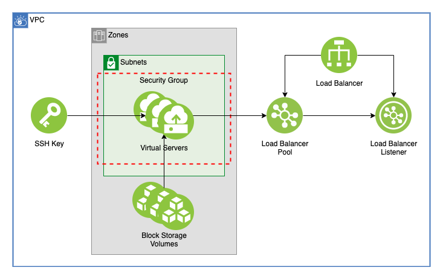

# VSI Workspace With Load Balancer

This module creates any number of VSI accross any number of subnets and connects them with a single load balancer. For this example module, Nginx is installed on all of the virtual servers and publicly available via the Load Balancer.

## Table of Contents

1. [Setup](##Setup)
2. [Server Images](##server-images)
3. [Security Group](##security-group)
4. [Virtual Servers](##virtual-servers)
5. [Storage](##storage)
6. [Load Balancer](##load-balancer)
7. [Module Variables](##module-variables)

---

## Setup

In order to make sure your load balancers are able to work on your subnet, ensure that your ACL rules for the subnets where your VSI will be provisioned are configured to allow for **at least** the following rules [[1]](https://cloud.ibm.com/docs/vpc-on-classic-network?topic=vpc-on-classic-network---using-load-balancers-in-ibm-cloud-vpc#configuring-acls-for-use-with-load-balancers):

Inbound/Outbound | Protocol  | Source IP     | Source Port              | Destination IP | Destination Port
-----------------|-----------|---------------|--------------------------|----------------|-----------------
Inbound          |  UDP/TCP  | 161.26.0.0/16 |  53, 80, 443, 1688, 8443 | AnyIP          | AnyPort
Inbound          |  TCP      | AnyIP         |  AnyPort                 | AnyIP          | 56501
Inbound          |  TCP      | AnyIP         |  443, 10514, 8834        | AnyIP          | AnyPort
Outbound         |  UDP/TCP  | AnyIP         |  AnyPort                 | 161.26.0.0/16  | 53, 80, 443, 1688, 8443
Outbound         |  TCP      | AnyIP         |  56501                   | AnyIP          | AnyPort
Outbound         |  TCP      | AnyIP         |  AnyPort                 | AnyIP          | 443, 10514, 8834

---

## Server Images

This module uses Ubuntu 18.04 to install nginx. Use the `ibmcloud is images` command to check to see what images are available in your region. The image used is set by the `image` variable. As a default use:

- For Gen 1 use `ubuntu-18.04-amd64` or a similar image.
- For Gen 2 use `ibm-ubuntu-18-04-1-minimal-amd64-1` or a similar image.

---

## Security Group

In order to run the [installation script](./config/ubuntu_install_nginx.sh) a security group must be setup to access the internet to update and install packages. In this example, a group is created to allow all inbound and outbound traffic to the virtual servers. This group is connected to their primary network interface. This group and it's rules can be changed in [`vsi_module/security_groups.tf`](./vsi_module/security_groups.tf)

---

## Virtual Servers

This module will create any number of VSI accross any number of subnets in a given VPC. The virtual servers will require the use of a SSH Public Key that is created from the `ssh_public_key` variable.

### Subnets

The servers can be deployed on any number of subnets within a single vpc. Specify the subnets by name using the `subnet_names` variable. Use the `vsi_per_subnet` variable to specify how many virtual servers will be created on each of the subnets.

### Virtual Server Setup

For the `machine_type` variable, use the `ibmcloud is instance-profiles` command to find an image that will work in your region. As a default use:

- For Gen 1 use `bc1-2x8`
- For Gen 2 use `bx2-2x8`

### Enable Floating IPs

For testing it's often helpful to attach a floating IP to a Virtual Server for remote access from your local machine. Set the `enable_fip` variable to true to add a floating IP to **all** instances created by this module. This will make your Virtual Servers accessable from the public internet.

---

## Volumes

This module creates a Block Storage volume for each map in the `volumes` variable for each of the VSI being created and attaches them to the Virtual Servers. These volumes are created in the resource group the Virtual Servers.

Volume maps can contain the following keys:

Key            | Type          | Required | Description  
---------------|---------------|----------|-------------
name           | string        | true     | Name of the volumes to be created
profile        | string        | true     | Profile to use for these volumes
iops           | number        | false    | Total input/output per second. Only use if `profile` is `custom`
capacity       | number        | false    | Capacity of volume in GB. Default is `100`
encryption_key | string        | false    | Key to use for encrypting this volume
tags           | list(string)  | false    | A list of tags to attach to these volumes
---

## Load Balancer

This creates a single load balancer to balance accross all the virtual servers created by this module. The load balancer is composed of four parts:

- Load Balancer
- Load Balancer Back End Pool
- Load Balancer Pool Members
- Load Balancer Listener

### Load Balancer Instance

This creates a load balancer resource. This load balancer can be set to either `public` or `private` using the `type` variable

### Back End Pool

This creates a pool that will route traffic to the virtual server instances. It will also monitor the health of those instances

### Pool Members

This adds the `primary_ipv4_address` of each virtual server to the pool, and will tell the pool to listen on a specific port. In the example we are installing nginx that runs on port `80`

### Listener

This creates a listener for the load balancer that will send traffic to the pool. All pool members must be added before the listener will be created

---

## Module Variables

Variable               | Type   | Description                                                                                                                                                                                         | Default
-----------------------|--------|-----------------------------------------------------------------------------------------------------------------------------------------------------------------------------------------------------|--------
`ibmcloud_api_key`     | string | The IBM Cloud platform API key needed to deploy IAM enabled resources                                                                                                                               |
`ibm_region`           | string | IBM Cloud region where all resources will be deployed                                                                                                                                               | `us-south`
`generation`           | String | Generation of VPC                                                                                                                                                                                   | `1`
`resource_group`       | string | Name of resource group to create VPC                                                                                                                                                                | `asset-development`
`vpc_name`             | string | Name of VPC                                                                                                                                                                                         |
`unique_id`            | string | The IBM Cloud platform API key needed to deploy IAM enabled resources                                                                                                                               | `asset-module-lb`
`image`                | string | Image name used for VSI. Run 'ibmcloud is images' to find available images in a region                                                                                                              | `ibm-ubuntu-18-04-1-minimal-amd64-1`
`subnet_names`         | String | A list of subnet names where VSI will be deployed. Must exist within the VPC                                                                                                                        | 
`vsi_per_subnet`       | String | Number of VSI instances for each subnet. All VSI will be connected by a single load balancer                                                                                                        | `1`
`ssh_public_key`       | string | ssh public key to use for vsi                                                                                                                                                                       |
`machine_type`         | string | VSI machine type. Run 'ibmcloud is instance-profiles' to get a list of regional profiles. For Gen 1 use bc1-2x8, for Gen 2 use bx2-2x8                                                              | `bc1-2x8`
`enable_fip`           | String | Enable floating IP. Can be true or false                                                                                                                                                            | `false`
`type`                 | string | Load Balancer type, can be public or private                                                                                                                                                        | `public`
`listener_port`        | Number | Listener port                                                                                                                                                                                       | `80`
`listener_protocol`    | string | The listener protocol. Supported values are http, tcp, and https                                                                                                                                    | `http`
`certificate_instance` | string | Optional, the CRN of a certificate instance to use with the load balancer.                                                                                                                          | 
`connection_limit`     | Number | Optional, connection limit for the listener. Valid range 1 to 15000.                                                                                                                                | `0`
`algorithm`            | string | The load balancing algorithm. Supported values are round_robin, or least_connections. This module can be modified to use weighted_round_robin by adding `weight` to the load balancer pool members. | `round_robin`
`protocol`             | string | The pool protocol. Supported values are http, and tcp.                                                                                                                                              | `http`
`health_delay`         | Number | The health check interval in seconds. Interval must be greater than timeout value.                                                                                                                  | `11`
`health_retries`       | Number | The health check max retries.                                                                                                                                                                       | `10`
`health_timeout`       | Number | The health check timeout in seconds.                                                                                                                                                                | `10`
`health_type`          | string | The pool protocol. Supported values are http, and tcp.                                                                                                                                              | `http`
`pool_member_port`     | Number | The port number of the application running in the server member.                                                                                                                                    | `80`
